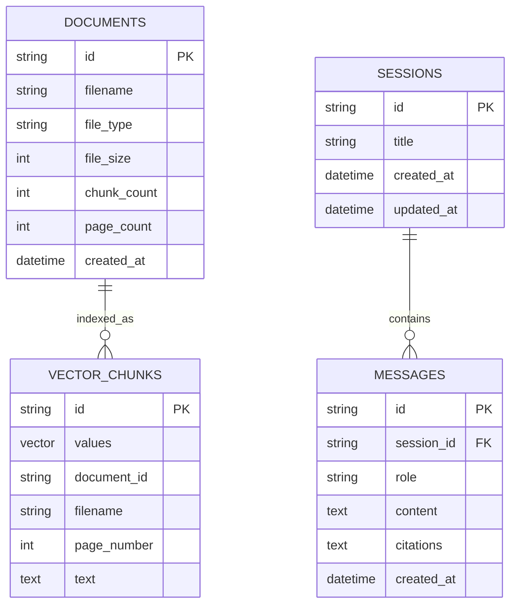

# DocuSphere RAG: Multi-Document Question Answering System

[](https://opensource.org/licenses/MIT)
[](https://nodejs.org/)
[](https://react.dev/)
[](https://www.docker.com/)
[]()

> A production-ready, enterprise-grade **Retrieval-Augmented Generation (RAG)** system designed for multi-document question answering across PDF and DOCX files with vector similarity search, conversational session memory, strict anti-hallucination guardrails, and programmatic citation verification down to the exact source document and page number.

---

## 📑 Table of Contents
- [Architectural Overview](#-architectural-overview)
- [Key Features](#-key-features)
- [Document Ingestion Pipeline](#-document-ingestion-pipeline)
- [Query & Retrieval Pipeline](#-query--retrieval-pipeline)
- [Chunking Strategy & Page Preservation](#-chunking-strategy--page-preservation)
- [Database Schema (Dual-Database Design)](#-database-schema-dual-database-design)
- [Getting Started](#-getting-started)
  - [Prerequisites](#prerequisites)
  - [Single-Command Setup](#single-command-setup)
  - [Running via Docker](#running-via-docker)
- [Environment Configuration](#-environment-configuration)
- [REST API Reference](#-rest-api-reference)
- [Evaluation & Verification Scenarios](#-evaluation--verification-scenarios)
- [Running Automated Tests](#-running-automated-tests)
- [License](#-license)

---

## 🏛️ Architectural Overview

The system strictly decouples the asynchronous **Ingestion Pipeline** (document parsing, chunking, embedding, and vector storage) from the synchronous **Query Pipeline** (vector similarity retrieval, threshold filtering, history injection, and LLM generation).

```mermaid
flowchart TD
    subgraph Ingestion_Pipeline ["Ingestion Pipeline (Asynchronous / Batch)"]
        A[Raw PDF / DOCX Upload] --> B[Text & Page Extractor]
        B --> C[Page-Preserving Text Chunker]
        C --> D[Batched Embedding Generator]
        D --> E[(Persistent Vector Database)]
        B --> F[(SQLite Relational DB)]
    end

    subgraph Query_Pipeline ["Query Pipeline (Synchronous / Real-Time)"]
        G[User Query + Session ID] --> H[Query Vectorizer]
        H --> I[Cosine Similarity Top-K Search]
        E --> I
        I --> J{Similarity Threshold Filter}
        J -- "Score < Threshold / 0 Chunks" --> K[Deterministic Fallback Response]
        J -- "Score >= Threshold" --> L[Context Block Formatter]
        F -- "Fetch Recent History" --> M[History Turns Injector]
        M --> N[Strict Prompt Builder]
        L --> N
        N --> O[LLM Generation (Temp: 0.0)]
        O --> P[Structured Citation Extractor]
        P --> Q[Persist Turns in SQLite]
        Q --> R[Final Response Payload + Citations Array]
        K --> Q
    end
```

---

## ✨ Key Features

1. **Dual-Format Document Ingestion**: Seamlessly extracts text and metadata from `.pdf` (preserving 1-indexed page numbers) and `.docx` (preserving semantic paragraph blocks).
2. **Page-Preserving Sliding Window Chunking**: Natural break-point detection (`. `, `\n\n`, `! `, `? `) with configurable chunk size (default 800 chars) and overlap (default 150 chars).
3. **High-Dimensional Vector Similarity Search**: Persistent vector database calculating Cosine Similarity across embeddings with strict confidence thresholding.
4. **Anti-Hallucination Guardrails**: Deterministic bypass mechanism when retrieved chunks fall below confidence threshold, immediately returning `"I could not find an answer in the provided documents."` with zero LLM hallucinations.
5. **Multi-Turn Conversational Memory**: Relational tracking of chat sessions and sequential message history for pronoun resolution (`they`, `it`, `that`).
6. **Programmatic Citation Verification**: Responses return structured citations `[{ document_name, page_number }]` corresponding to verified context chunks.
7. **Modern Glassmorphic React UI**: Dark-mode interface with live vector counters, drag-and-drop document manager, interactive source context inspector modal, and evaluation playground.
8. **Multi-Provider AI Engine**: Native support for OpenAI (`gpt-4o-mini`, `text-embedding-3-small`), Google Gemini (`gemini-2.5-flash`, `text-embedding-004`), and built-in offline deterministic vectorizer.

---

## 🔄 Document Ingestion Pipeline

When files are uploaded to `POST /api/upload`:
1. **Validation**: Checks file extensions (`.pdf`, `.docx`) and MIME types.
2. **Text & Metadata Extraction**: `pdfjs-dist` extracts text page-by-page preserving explicit `pageNumber`. `mammoth` extracts structured headings and paragraphs from DOCX.
3. **Sliding-Window Chunking**: Splits text into overlapping segments without breaking sentences in half, embedding `{ document_id, filename, page_number, chunk_index, text }` in every chunk.
4. **Batched Vectorization**: Vectorizes text chunks in batches of 20–50 items to optimize throughput and mitigate API rate limits.
5. **Dual Persistence**: Vectors and metadata are indexed into the Vector Store; document records are logged to SQLite.

---

## ⚡ Query & Retrieval Pipeline

When a user asks a question via `POST /api/chat`:
1. **Query Embedding**: Embeds query using the identical embedding model used during ingestion.
2. **Top-K Vector Search**: Queries the Vector DB for Top-5 nearest neighbors using Cosine Similarity:
   $$\text{Similarity}(u, v) = \frac{u \cdot v}{\|u\|_2 \|v\|_2}$$
3. **Threshold Filtering**: Discards results where $\text{Similarity} < \text{THRESHOLD}$ (default 0.65).
4. **Fallback Guard**: If zero chunks pass the threshold, bypasses LLM entirely to save latency and prevent hallucinations.
5. **Conversation State Injection**: Fetches the last 4 message pairs from SQLite to resolve pronouns and conversational references.
6. **Prompt Assembly**: Formats retrieved chunks into rigid context delimiters:
   ```
   --- CONTEXT START ---
   Source: employee_handbook.pdf (Page 1)
   Text: Full-time employees are entitled to 20 days of paid time off per calendar year...
   --- CONTEXT END ---
   ```
7. **Deterministic Generation**: Generates grounded answer using temperature `0.0` and extracts citations into structured JSON.
8. **Persistence**: Saves user query, assistant response, and citations into SQLite `messages` table.

---

## ✂️ Chunking Strategy & Page Preservation

```
Raw Page Text (Page 1)
├── [Chunk 0 (0 -> 800 chars)]   ──> metadata: { page: 1, filename: "handbook.pdf", ... }
│    └── Overlap: 150 chars ──┐
├── [Chunk 1 (650 -> 1450 chars)] <─┘ metadata: { page: 1, filename: "handbook.pdf", ... }
```

### Why Sliding Window with Overlap?
- **Prevents Split Sentences**: Sentences severed at character boundaries are preserved in their entirety in the subsequent overlapping chunk.
- **Natural Boundary Snapping**: Looks ahead up to 60 characters for sentence endings (`. `, `\n\n`) to avoid breaking mid-word.
- **Page Tag Integrity**: Chunks created from Page $N$ explicitly retain `page_number: N` in their vector metadata payload, enabling precise UI source inspection.

---

## 🗄️ Database Schema (Dual-Database Design)



---

## 🚀 Getting Started

### Prerequisites
- **Node.js**: v18.0.0 or higher (v20+ recommended)
- **npm**: v9.0.0 or higher
- Optional: **Docker & Docker Compose**

### Single-Command Setup

1. **Clone the repository**:
   ```bash
   git clone https://github.com/hemakoppireddy/rag_system-multi-document-qa-.git
   cd rag_system-multi-document-qa-
   ```

2. **Configure environment variables**:
   ```bash
   cp .env.example .env
   ```
   *(Optionally add your `OPENAI_API_KEY` or `GEMINI_API_KEY`. If left empty, the system automatically uses the high-performance local deterministic embedding engine).*

3. **Install dependencies and build**:
   ```bash
   npm run setup
   ```

4. **Start the application**:
   ```bash
   npm start
   ```
   Open your browser at **[http://localhost:3000](http://localhost:3000)**.

---

### 🐳 Running via Docker

To run the entire system in a containerized environment with zero local setup:

```bash
docker compose up --build
```
Access the application at `http://localhost:3000`.

---

## ⚙️ Environment Configuration

Refer to `.env.example` for all configurable parameters:

| Variable | Type | Default | Description |
| :--- | :--- | :--- | :--- |
| `PORT` | `number` | `3000` | HTTP server port |
| `AI_PROVIDER` | `string` | `openai` | AI Provider: `openai`, `gemini`, or `local` |
| `OPENAI_API_KEY` | `string` | `""` | OpenAI API Key (optional if using local) |
| `GEMINI_API_KEY` | `string` | `""` | Google Gemini API Key |
| `LLM_MODEL` | `string` | `gpt-4o-mini` | LLM model name |
| `EMBEDDING_MODEL` | `string` | `text-embedding-3-small` | Vector embedding model |
| `SIMILARITY_THRESHOLD` | `float` | `0.65` | Minimum cosine similarity confidence score |
| `TOP_K` | `number` | `5` | Top-K context chunks to retrieve |
| `CHUNK_SIZE` | `number` | `800` | Target character size per text chunk |
| `CHUNK_OVERLAP` | `number` | `150` | Number of overlapping characters |
| `DATABASE_PATH` | `string` | `./data/rag_history.db` | SQLite database file location |
| `VECTOR_STORE_PATH`| `string` | `./data/vector_store.json`| Persistent vector store location |

---

## 📡 REST API Reference

### 1. Ingest Documents
**`POST /api/upload`**  
Accepts `multipart/form-data` containing one or more `.pdf` and `.docx` files.

```bash
curl -X POST http://localhost:3000/api/upload \
  -F "files=@tests/fixtures/employee_handbook.pdf" \
  -F "files=@tests/fixtures/contractor_guidelines.docx"
```

**Response (200 OK):**
```json
{
  "success": true,
  "documentsProcessed": 2,
  "documents": [
    {
      "documentId": "48b3b4f6-efb7-4c4f-9e79-58ec789cf9e5",
      "filename": "employee_handbook.pdf",
      "fileType": "pdf",
      "pageCount": 2,
      "chunkCount": 2
    }
  ],
  "message": "Successfully processed 2 document(s)."
}
```

---

### 2. Chat & Question Answering
**`POST /api/chat`**  
Synchronous query pipeline with semantic retrieval, threshold filtering, history injection, and structured citations.

```bash
curl -X POST http://localhost:3000/api/chat \
  -H "Content-Type: application/json" \
  -d '{
    "query": "How many days of PTO do full-time employees receive?",
    "session_id": "optional-session-uuid"
  }'
```

**Response (200 OK):**
```json
{
  "success": true,
  "answer": "Full-time employees are entitled to 20 days of paid time off (PTO) per calendar year. [employee_handbook.pdf, Page 1]",
  "citations": [
    {
      "document_name": "employee_handbook.pdf",
      "page_number": 1
    }
  ],
  "session_id": "4d16688e-67fe-49b0-94e8-8b85fa19ea3a",
  "retrieved_chunks_count": 2
}
```

---

### 3. List Ingested Documents
**`GET /api/documents`**

```bash
curl -X GET http://localhost:3000/api/documents
```

---

### 4. Delete Document
**`DELETE /api/documents/:id`**  
Deletes document from relational DB and cascades deletion to vector store.

```bash
curl -X DELETE http://localhost:3000/api/documents/48b3b4f6-efb7-4c4f-9e79-58ec789cf9e5
```

---

### 5. List Chat Sessions
**`GET /api/sessions`**

```bash
curl -X GET http://localhost:3000/api/sessions
```

---

### 6. Get Session Conversation History
**`GET /api/sessions/:id`**

```bash
curl -X GET http://localhost:3000/api/sessions/4d16688e-67fe-49b0-94e8-8b85fa19ea3a
```

---

### 7. Health Check
**`GET /api/health`**

```bash
curl -X GET http://localhost:3000/api/health
```

---

## 🧪 Evaluation & Verification Scenarios

The system is pre-configured and tested against four deterministic evaluation scenarios:

| # | Scenario | Query | Expected Grounded Behavior | Citations |
| :- | :--- | :--- | :--- | :--- |
| **1** | **Fact Retrieval** | *"How much PTO do full-time employees get?"* | Answers `20 days` based on handbook | `[employee_handbook.pdf, Page 1]` |
| **2** | **Multi-Doc Synthesis** | *"Compare PTO for employees versus contractors"* | Synthesizes employee 20 days PTO vs contractor 0 benefits | `[employee_handbook.pdf, Page 1]`, `[contractor_guidelines.docx, Page 1]` |
| **3** | **Pronoun Follow-up** | *"Can they carry it over into next year?"* | Resolves "they" to employees and answers `up to 5 days` | `[employee_handbook.pdf, Page 1]` |
| **4** | **Anti-Hallucination** | *"What is the capital of France?"* | Triggers threshold bypass and returns exact fallback: `"I could not find an answer in the provided documents."` | `[]` |

---

## 🔬 Running Automated Tests

The test suite validates document parsing, chunking with metadata preservation, vector similarity math, anti-hallucination fallback, and end-to-end API routes:

```bash
npm test
```

**Test Coverage Summary:**
- `document.test.js`: Validates page-by-page PDF extraction and DOCX block parsing.
- `chunking.test.js`: Validates sliding window overlap and metadata retention.
- `vector_store.test.js`: Validates cosine similarity, top-K ranking, and threshold filtering.
- `rag_orchestration.test.js`: Validates all 4 evaluation scenarios (single-doc, multi-doc, follow-up, fallback).
- `api.test.js`: Validates all HTTP API routes via Supertest.

---

## 📜 License
This project is licensed under the **MIT License** - see the [LICENSE](LICENSE) file for details.
